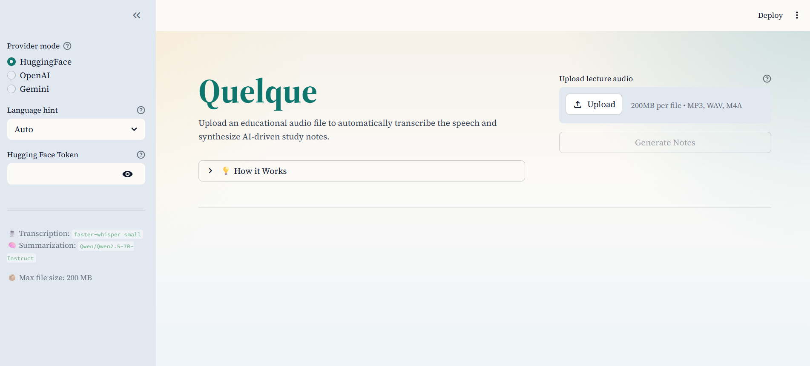
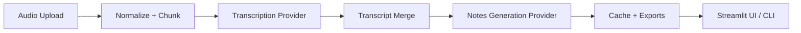

# Quelque: Lecture-to-Notes Assistant

[](https://www.python.org/downloads/release/python-3110/)
[](https://opensource.org/licenses/MIT)
[](https://github.com/astral-sh/ruff)

Quelque is an open-source tool designed to transform long-form educational audio (lectures, class recordings, study sessions) into structured, highly readable study materials. 



Rather than just providing a raw transcript, Quelque uses a **two-step pipeline**:
1. **Transcription**: Converts the audio to a highly accurate, word-for-word transcript.
2. **LLM Sanitization & Summarization**: Analyzes the raw transcript to clean speech-to-text errors and punctuation, and synthesizes it into a concise summary, key takeaways, detailed study notes, a glossary of terms, and actionable items.

## Features

- **Robust Processing**: Upload MP3, WAV, or M4A files. The audio is automatically normalized, chunked, and transcribed.
- **Multiple AI Providers**: Choose your preferred engine for both steps:
  - **OpenAI**: High-quality transcription (Whisper) and summarization (GPT-4o) using modern cloud models.
  - **Google Gemini**: Lightning-fast, high-quality notes generation using Google AI Studio.
  - **No Host (Free)**: 100% zero-cost processing using a local `faster-whisper` model for offline transcription and the Hugging Face Free Serverless API (`Qwen-2.5-7B`) for summarization.
- **Language Hints**: Force the transcriber to listen in a specific language and instruct the AI to write the final notes in that same language.
- **Rich Exports**: Download your generated notes in Markdown, DOCX (Microsoft Word), or PDF formats.
- **Smart Caching**: Audio processing is cached using SHA-256 hashing to prevent redundant API calls and save time.

## Quick Start

### Running Locally

Ensure you have Python 3.11+ and `ffmpeg` installed on your system.

```bash
# Clone the repository
git clone https://github.com/your-username/quelque.git
cd quelque

# Create and activate a virtual environment
python -m venv .venv
# Windows: .venv\Scripts\activate
# Unix/MacOS: source .venv/bin/activate

# Install the application and dependencies
pip install -e .

# Set up environment variables
copy .env.example .env
```

If you plan to use the hosted cloud models, edit your `.env` file to include your `OPENAI_API_KEY`, `GOOGLE_API_KEY`, or `HF_TOKEN`.

Start the web interface:

```bash
streamlit run streamlit_app.py
```

### Command Line Interface (CLI)

Quelque also includes a powerful CLI for batch processing:

```bash
# Generate full notes using the default local transcription and Hugging Face API
quelque notes samples/tiny_sanitized_sample.wav --language en

# Transcribe audio using OpenAI instead of the local provider
quelque transcribe samples/tiny_sanitized_sample.wav --provider openai --language en
```

## Architecture

Quelque is built with a modular, API-first design that separates audio processing, transcription, and text analysis.



## Supported Models

By default, Quelque is configured to use:
- **OpenAI Transcription**: `gpt-4o-mini-transcribe`
- **OpenAI Notes**: `gpt-4o-mini`
- **Google Notes**: `gemini-2.5-flash`
- **No Host Notes**: `Qwen/Qwen2.5-7B-Instruct` (via Hugging Face API)
- **Local Transcription**: `faster-whisper` (small model)

You can override these defaults by setting the corresponding environment variables (e.g., `QUELQUE_LOCAL_TRANSCRIPTION_MODEL=base`).

## Security & Deployment

- **Ephemeral Keys**: When running the UI, user-provided API keys are kept strictly in memory for that specific session and are explicitly masked in internal configurations to prevent leakage in logs or tracebacks.
- **Hugging Face Spaces**: Quelque is fully Dockerized and ready to be deployed to a **Hugging Face Docker Space**. Simply create a new Space, push the repository, and it will work out of the box.

## License

MIT License. See `LICENSE` for details.
